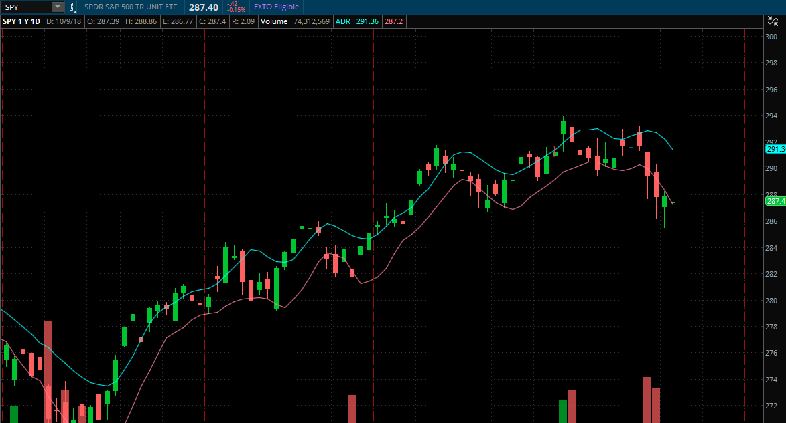
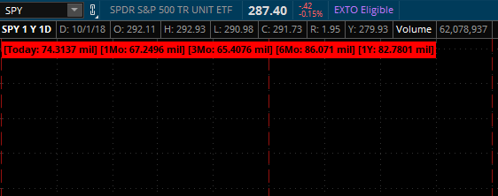
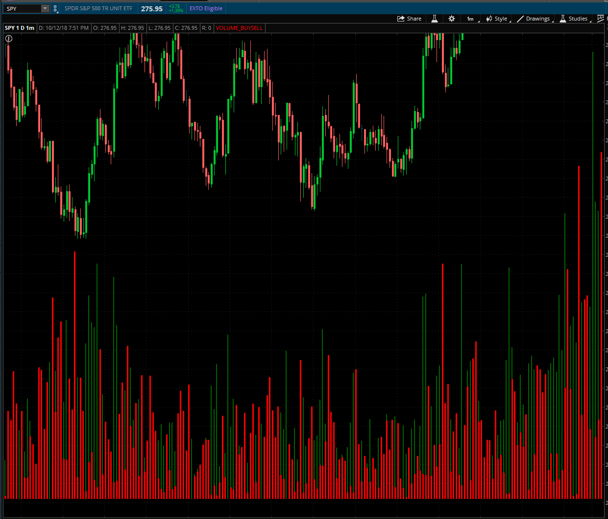
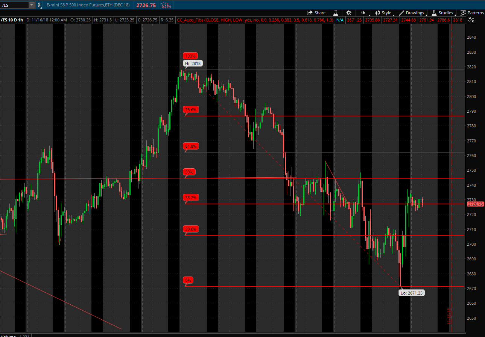
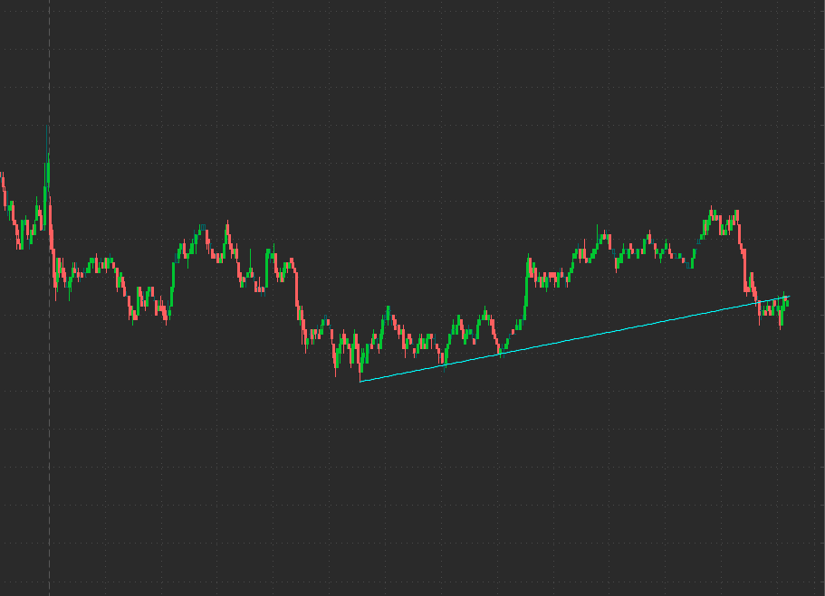
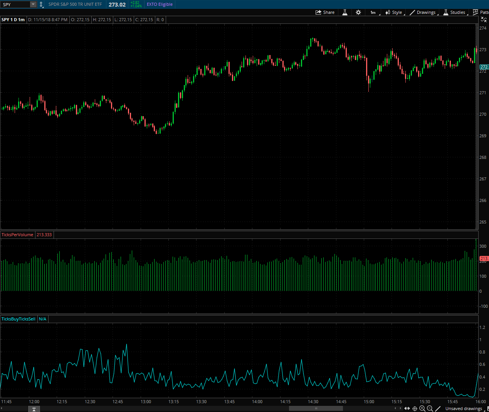

# Thinkorswim-Indicators

Various trading indicators for ThinkorSwim. The code can be found in the './indicators/' folder and the descriptions are below.

## ADR (Average Daily Range)

Standard average daily range calculation and plot

## VolumeVsAverageST

Displays volume for the day compared to the average volume for the past month, past 3 months, past 6 months, and past year.

Use VolumeVsAverageLT for longer periods for average volume.

## Volume Up Tick Down tick

Shows volume bars for each cancle as two separate bars, one for sell volume (red) and one for buy volume (green).

## AutoFibs

Automatically draws fibonacci retracements using the highest price and lowest price from the current view and timeframe.

## AutoTrendline

Automatically draws a trendline as an RBL (rising bottom line) or DTL (descending top line).

## Ticks

The follow 2 indicators are best used in situations where one would want to know if the majority of trading is machine-driven or not.

### TicksPerVolume
Shows volume divided by ticks or in other words the volume traded divided by the number of trades. Higher means larger lots being traded and lower bar means smaller lots.

### TicksBuyTicksSell
Shows the number of trades on the buy side plus the number of trades on the sell side divided by the number of trades.

